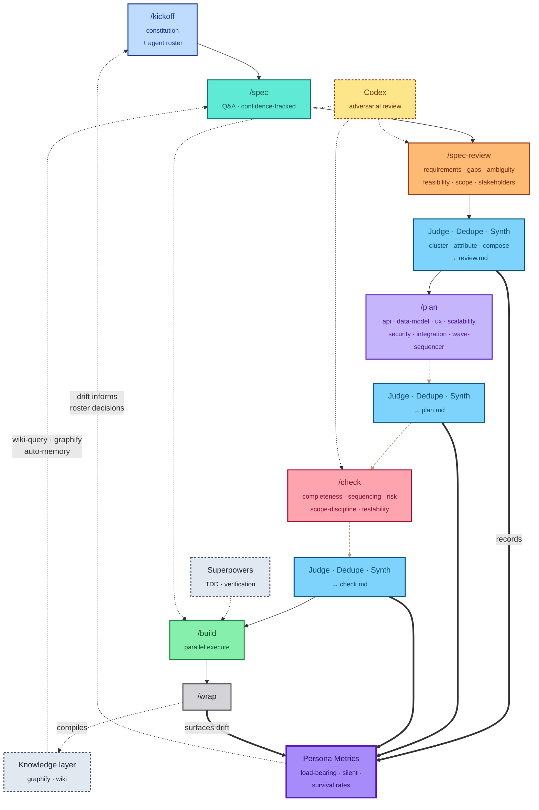
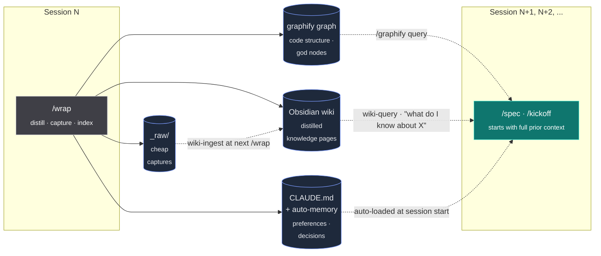

# Claude Workflow Pipeline

An 8-command pipeline for [Claude Code](https://claude.com/claude-code) that adds structured planning, multi-agent review, and execution discipline to any project.

**You say WHAT. Claude handles HOW.** Bug fix, small change, feature, or full V2 — the same pipeline scales. 27 default agent personas review your spec and plan before code gets written, and an end-of-session `/wrap` compiles what you learned into durable memory.

**Install (one-liner):**
```bash
git clone https://github.com/Jstottlemyer/MonsterFlow.git ~/Projects/MonsterFlow && cd ~/Projects/MonsterFlow && ./install.sh
```

Then open any project and type `/kickoff` to initialize, or `/flow` to see the reference card.

**License:** MIT — see [LICENSE](LICENSE).

## What This Is

A complete workflow system that scales to the size of the work:

| Work Size | Pipeline |
|-----------|----------|
| Bug fix | Describe it, fix it, verify |
| Small change | `/spec` (quick) then `/build` |
| Feature | Full pipeline: `/kickoff` through `/build` |
| V2 / Rework | Revise existing spec, then full pipeline |

## The Pipeline



```
/kickoff → /spec → /spec-review → /plan → /check → /build
           define    6 PRD        7 design  5 plan   execute
           (Q&A)     agents       agents    agents   (parallel)
```

### The knowledge loop

`/wrap` doesn't just end a session — it compiles what you learned into stores that **the next session reads from**. Every `/spec` and `/kickoff` starts smarter than the last.



**Compile, don't retrieve.** Capture is cheap during the session (`"capture this: X"` → `_raw/`). Distillation happens once at `/wrap`. Reads at the start of the next session are free — the wiki is already structured, the graph is already built, memory is already loaded.

| Command | What It Does | Agents |
|---------|-------------|--------|
| `/kickoff` | One-time project init — scans repo, drafts constitution, selects agent roster | - |
| `/spec` | Confidence-tracked Q&A — writes `spec.md` (falls back to session roster if no constitution) | Interactive |
| `/spec-review` | Parallel PRD review — gaps, risks, ambiguity; + Codex adversarial pass (optional) | 6 reviewers |
| `/plan` | Architecture + implementation design | 7 designers |
| `/check` | Last gate before code — validates the plan; + Codex adversarial pass (optional) | 5 validators |
| `/build` | Parallel execution with verification discipline; + Codex implementation review (optional) | Superpowers |
| `/autorun` | Headless overnight pipeline — queues a spec and drives all 8 stages unattended via `autorun start` | Shell |
| `/flow` | Displays workflow reference card | - |
| `/wrap` | Session wrap-up — summary, learnings, git loose ends | - |
| `/autorun-dryrun` | Smoke-tests the full autorun pipeline in `AUTORUN_DRY_RUN=1` mode against a fixture spec — asserts every artifact lands. Use after editing `scripts/autorun/*.sh` | Shell |
| `/bump-version` | Semver bump `VERSION` + commit + annotated tag. Refuses dirty trees, non-`main` branches (override with `--force-branch`), and pre-existing tags | Shell |

<details>
<summary><strong>The full <code>/flow</code> reference card</strong> — click to expand</summary>

```text
╔══════════════════════════════════════════════════════════════╗
║                    SESSION WORKFLOW                          ║
╠══════════════════════════════════════════════════════════════╣
║                                                              ║
║  PROJECT SETUP (once per project)                            ║
║  /kickoff  →  constitution + agent roster                    ║
║                                                              ║
║  FEATURE (full pipeline)                                     ║
║  /spec  →  /spec-review  →  /plan  →  /check  →  /build      ║
║   define    6 PRD          7 design   5 plan     execute     ║
║   (Q&A)     agents         agents     agents     (parallel)  ║
║  + firecrawl (research) · context7 (API docs)                ║
║  + codex adversarial review at spec-review, check, build     ║
║    (optional — silent skip if not set up)                    ║
║                                                              ║
║  WORK-SIZE SCALING                                           ║
║  Bug fix:      describe it → fix it → verify                 ║
║  Small change: /spec (quick) → /build                        ║
║  Feature:      full pipeline above                           ║
║  V2/Rework:    revise existing spec → full pipeline          ║
║                                                              ║
║  PARALLEL WORK                                               ║
║  "work on X, Y, and Z in parallel"                           ║
║    → Each dispatched to a subagent                           ║
║                                                              ║
║  IN-SESSION DISCIPLINE                      [Superpowers]    ║
║  → systematic-debugging · verification-before-done           ║
║  → requesting-code-review · ralph-loop (micro-iteration)     ║
║                                                              ║
║  CODE REVIEW                                                 ║
║  Quick:  superpowers requesting-code-review                  ║
║  PR:     /code-review plugin                                 ║
║  Full:   9 parallel code-review personas                     ║
║                                                              ║
║  ARTIFACTS                                                   ║
║  docs/specs/constitution.md     (project principles)         ║
║  docs/specs/<feature>/spec.md   (living spec)                ║
║  docs/specs/<feature>/review.md (PRD review findings)        ║
║  docs/specs/<feature>/plan.md   (implementation plan)        ║
║  docs/specs/<feature>/check.md  (gap checkpoint)             ║
║                                                              ║
║  KNOWLEDGE LAYER                   [graphify + obsidian]     ║
║  Fires automagically at /wrap — no typing, no friction:      ║
║    _raw/ → wiki pages           (wiki-ingest)                ║
║    session → projects/<name>/   (wiki-update)                ║
║    graph export + lint          (wiki-export · wiki-lint)    ║
║    graphify digest → _raw/      (silent arch snapshot)       ║
║  Manual (rare):                                              ║
║    /graphify [path]    build code knowledge graph            ║
║    /graphify query "Q" graph traversal answer                ║
║    "what do I know about X"  wiki-query                      ║
║    "capture this: X"         wiki-capture → _raw/            ║
║  Compile, don't retrieve. Capture cheap, distill at /wrap.   ║
║                                                              ║
║  SESSION END                                                 ║
║  /wrap → summary · learnings · knowledge flush · git ends    ║
║                                                              ║
╠══════════════════════════════════════════════════════════════╣
║  AGENTS: review(6) plan(6) check(5) code-review(9)           ║
║  + judge · synthesis · domain agents                         ║
║                                                              ║
║  PLUGINS                                                     ║
║  Always-on:  superpowers · context7                          ║
║  On-demand:  firecrawl · code-review · ralph-loop            ║
║              playwright                                      ║
║  Periodic:   claude-md-management · skill-creator            ║
║              claude-code-setup                               ║
║  Optional:   codex — adversarial review at spec-review,      ║
║              /check, /build (silent skip if not set up)      ║
║                                                              ║
║  Superpowers: in-session execution discipline                ║
║  Plugins: specialized capabilities                           ║
║  You say WHAT. Claude handles HOW.                           ║
╚══════════════════════════════════════════════════════════════╝
```

</details>

## Agent Roster (40 total)

The repo ships **40 agents = 38 personas (29 pipeline + 9 domain) + 2 focused subagents**:

- **29 always-available pipeline personas** — dispatched by `/spec-review`, `/plan`, `/check`, `/build` in parallel slices.
- **9 domain personas** — loaded conditionally at `/kickoff` based on project signals.
- **2 Claude Code subagents** — invoked directly via `Agent(subagent_type: ...)`. See the [Subagents](#subagents-focused-reviewers) section below.

A single session calls **only the subset relevant to the current phase** — never all 40 at once. Each `/spec-review`, `/plan`, `/check`, or `/build` invokes its own slice.

### Pipeline agents (28) — always available

| Stage | Count | Personas |
|-------|-------|----------|
| Review (`/spec-review`) | 6 | Requirements · Gaps · Ambiguity · Feasibility · Scope · Stakeholders |
| Plan (`/plan`) | 7 | API · Data Model · UX · Scalability · Security · Integration · Wave Sequencer |
| Check (`/check`) | 5 | Completeness · Sequencing · Risk · Scope Discipline · Testability |
| Code review (full mode) | 9 | Correctness · Dependency · Design Quality · Documentation · Performance · Resilience · Security · Test Quality · Wiring |
| Synthesis layer | 2 | Judge (quality scoring) · Synthesis (multi-agent consolidation) — used by `/spec-review`, `/plan`, `/check` |

### Domain agents (9) — loaded conditionally at `/kickoff`

`domains/` ships extra personas that are **not** globally active. `install.sh` symlinks them into `~/.claude/domain-agents/<domain>/`, and `/kickoff` inspects the target project and copies only the relevant ones into `<project>/.claude/agents/`.

- **mobile/** — 6 iOS agents: swift-mentor, beta-feedback-triage, test-writer, feature-flag-manager, release-notes-writer, performance-advisor
- **games/** — 3 game-dev agents: game-state-reviewer, swiftui-scene-builder, accessibility-guardian

Projects can also carry their own agents in `<project>/.claude/agents/` (e.g. AuthTools adds 5 auth-specific agents from a separate private repo, bringing that project's roster to 42).

## Subagents (focused reviewers)

In addition to the pipeline personas, MonsterFlow ships two Claude Code subagents at `.claude/agents/` that you can invoke directly via `Agent(subagent_type: ...)`:

| Subagent | Purpose |
|----------|---------|
| `autorun-shell-reviewer` | Codifies the 13-pitfall checklist for `scripts/autorun/*.sh` — PIPESTATUS index correctness, `\|\| true` PIPESTATUS reset, `grep -c` arithmetic, branch invariants, STOP-file race windows, slug-regex enforcement, `eval` scope, SSH/HTTPS remote handling, AppleScript injection, `gh pr merge --auto` ambiguity, empty-PR loophole, truncated-diff silent pass, quoting. Returns High/Medium/Low findings with file:line. |
| `persona-metrics-validator` | Validates JSONL schema, foreign-key joins, and `artifact_hash` freshness across `docs/specs/*/{spec-review,plan,check}/` so `/wrap-insights` Phase 1c renders meaningful drift, not garbage. |

## Hooks

`settings/settings.json` ships PostToolUse hooks that fire on every `Write`/`Edit`:

- **`scripts/post-edit-shellcheck.sh`** — runs `shellcheck -x` on edited `.sh`/`.bash` files; emits findings as a `systemMessage`. Catches PIPESTATUS / quoting / unset-variable bugs at edit time.
- **`scripts/post-edit-json-validate.sh`** — runs `jq empty` on edited `.json` files. Surfaces stray-comma / missing-quote breakage immediately.

Both hooks are advisory-only (never block edits) and silent on clean inputs. They require `shellcheck` and `jq` on `$PATH`; they no-op silently if either is missing.

## Tests

Verify your install (or any change to the engine) with the test runner:

```bash
bash tests/run-tests.sh                # all 5 test files, 30+ assertions
bash tests/run-tests.sh hooks          # filter by name fragment
bash tests/autorun-dryrun.sh           # autorun smoke test in isolation
```

| Test file | What it covers |
|-----------|---------------|
| `test-hooks.sh` | shellcheck/jq hook behavior on clean and bad inputs |
| `test-agents.sh` | subagent frontmatter validation |
| `test-skills.sh` | SKILL.md frontmatter + `disable-model-invocation` typo guard |
| `test-bump-version.sh` | 12 assertions across all bump types + pre-condition refusals + `--dry-run` |
| `autorun-dryrun.sh` | full autorun pipeline in `AUTORUN_DRY_RUN=1` against an isolated tmp git repo |

CI-friendly: `tests/run-tests.sh` exits non-zero if any test fails.

## Install

```bash
git clone <this-repo> ~/Projects/MonsterFlow
cd ~/Projects/MonsterFlow
./install.sh
```

The installer symlinks commands, personas, templates, and settings into `~/.claude/`, then offers to install plugins.

## Plugin Dependencies

See [plugins.md](plugins.md) for the full list. Quick install:

```bash
# Required
claude plugins install superpowers context7

# Recommended
claude plugins install firecrawl code-review ralph-loop playwright
```

**Optional — Codex multi-model review:** `/spec-review`, `/check`, and `/build` can call Codex as an adversarial reviewer. It silently skips if Codex isn't configured. See [plugins.md](plugins.md) for setup.

## Artifacts

The pipeline writes persistent spec artifacts to each project:

```
docs/specs/constitution.md          # Project principles (from /kickoff)
docs/specs/<feature>/spec.md        # Living spec (from /spec)
docs/specs/<feature>/review.md      # PRD review findings (from /spec-review)
docs/specs/<feature>/plan.md        # Implementation plan (from /plan)
docs/specs/<feature>/check.md       # Gap checkpoint (from /check)
```

### Persona Metrics (v0.2.0+)

Every multi-agent gate (`/spec-review`, `/plan`, `/check`) emits structured measurement artifacts under `docs/specs/<feature>/<stage>/`:

```
spec-review/
  source.spec.md          # snapshot of spec.md at /spec-review start
  raw/<persona>.md        # one file per reviewer (incl. codex-adversary if applicable)
  findings.jsonl          # clustered findings, persona-attributed
  participation.jsonl     # every persona that ran (with status: ok/failed/timeout)
  run.json                # run_id, prompt_version, hashes, status
  survival.jsonl          # written at next stage's Phase 0 — judges what survived revision
```

`/wrap-insights` reads these to render per-persona `load_bearing_rate`, `survival_rate`, and `silent_rate` across a rolling 10-feature window. The pipeline becomes a measurement loop — over time, drift signals which personas are earning their slot.

**Privacy for adopters:** these artifacts contain verbatim review prose (`body` field) that may be sensitive. Adopter installs default to **opt-in-to-commit** (`PERSONA_METRICS_GITIGNORE=1` is set automatically; metrics paths are appended to your `.gitignore`). To commit metrics intentionally, set `PERSONA_METRICS_GITIGNORE=0` before running `install.sh`. `MonsterFlow`'s own repo overrides this default via name-detection in the installer.

## Customization

1. **Add project-specific agents** — create personas at `/kickoff` via the constitution template
2. **Add domain extensions** — drop agent `.md` files in `domains/<your-domain>/agents/`
3. **Personalize** — create a `~/CLAUDE.md` with your own context (role, projects, preferences)

## Structure

```
MonsterFlow/
├── install.sh                  # Installer — symlinks everything into ~/.claude/
├── plugins.md                  # Plugin dependency manifest
├── commands/                   # 10 pipeline commands (incl. /autorun, /flow, /wrap)
├── personas/                   # 28 agent personas (26 stage + judge, synthesis)
│   ├── check/       (5)
│   ├── code-review/ (9)
│   ├── plan/        (6)
│   └── review/      (6)
├── .claude/
│   ├── agents/                 # 2 focused subagents
│   │   ├── autorun-shell-reviewer.md
│   │   └── persona-metrics-validator.md
│   └── skills/                 # 2 user-only skills
│       ├── autorun-dryrun/
│       └── bump-version/
├── templates/
│   ├── constitution.md         # Project constitution template
│   └── repo-signals.md         # Domain-detection reference for /kickoff + /spec
├── settings/
│   └── settings.json           # Base settings (permissions, plugins, hooks)
├── scripts/
│   ├── autorun/                # Autonomous overnight pipeline (run/build/verify/notify)
│   ├── post-edit-shellcheck.sh # PostToolUse hook: shellcheck on .sh edits
│   ├── post-edit-json-validate.sh  # PostToolUse hook: jq empty on .json edits
│   ├── bump-version.sh         # /bump-version backing script
│   ├── session-cost.py         # Per-session cost reporter (used by /wrap)
│   └── doctor.sh               # Diagnostic report → auto-files GitHub Issue
├── tests/                      # 5 test files, 30+ assertions
│   ├── run-tests.sh            # CI runner
│   ├── test-{hooks,agents,skills,bump-version}.sh
│   ├── autorun-dryrun.sh       # full pipeline smoke test
│   └── fixtures/
└── domains/                    # Domain-specific extensions
    ├── mobile/                 # iOS development
    └── games/                  # Game development
```
