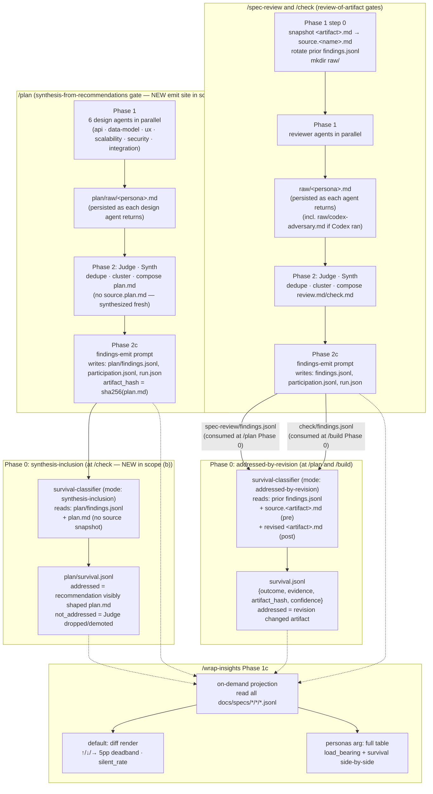

# Persona Metrics — Diagrams

Three diagrams covering: (1) the pipeline flow with the new feedback edges, (2) per-stage data flow, (3) the self-improvement loop the metrics enable.

These ship as the source of truth for documentation surfaces. **Diagram 1** lands in `README.md` and `docs/index.html` (replacing the existing pipeline mermaid). **Diagram 2** is reference-only for spec/plan/check.md readers. **Diagram 3** is the explainer for *why* the metrics layer matters — headlines the CHANGELOG entry and any future `docs/persona-metrics.md`.

> **Scope (b) is in effect:** all three multi-agent gates (`/spec-review`, `/plan`, `/check`) emit `findings.jsonl` + `participation.jsonl` + `run.json` at synthesis end. All three downstream stages (`/plan`, `/check`, `/build`) run the survival classifier at their Phase 0 pre-flight. `/plan` and `/build` use *addressed-by-revision* mode (pre-snapshot vs revised artifact). `/check` uses *synthesis-inclusion* mode (judges design recommendations against the freshly-synthesized `plan.md`; no source snapshot, since `plan.md` is created fresh, not revised).

---

## Diagram 1 — Pipeline flow (LOCKED — Tight-C variant)

Production-style mermaid with the new `Judge · Dedupe · Synth` interstitials between gates and a new `Persona Metrics` side observer. All three Judges feed PM. Tight-C tightening applied: only JS1 carries the full Judge sub-text (acts as legend); JS2/JS3 abbreviate to `→ plan.md` / `→ check.md`. Edge labels dropped except the two that explain the new feature: `records` on JS1→PM and `surfaces drift` on W→PM. Style carries meaning everywhere else (dashed orange = Codex challenges; dashed grey = ambient; thick violet = records to PM).

```mermaid
flowchart LR
    K["/kickoff<br/><sub>constitution<br/>+ agent roster</sub>"]:::setup
    S["/spec<br/><sub>Q&A · confidence-tracked</sub>"]:::define
    SR["/spec-review<br/><sub>requirements · gaps · ambiguity<br/>feasibility · scope · stakeholders</sub>"]:::review
    JS1["Judge · Dedupe · Synth<br/><sub>cluster · attribute · compose<br/>→ review.md</sub>"]:::synth
    P["/plan<br/><sub>api · data-model · ux · scalability<br/>security · integration · wave-sequencer</sub>"]:::plan
    JS2["Judge · Dedupe · Synth<br/><sub>→ plan.md</sub>"]:::synth
    C["/check<br/><sub>completeness · sequencing · risk<br/>scope-discipline · testability</sub>"]:::gate
    JS3["Judge · Dedupe · Synth<br/><sub>→ check.md</sub>"]:::synth
    B["/build<br/><sub>parallel execute</sub>"]:::execute
    W["/wrap"]:::wrap

    K --> S --> SR --> JS1 --> P --> JS2 --> C --> JS3 --> B --> W

    SP["Superpowers<br/><sub>TDD · verification</sub>"]:::side
    CX["Codex<br/><sub>adversarial review</sub>"]:::accent
    KL["Knowledge layer<br/><sub>graphify · wiki</sub>"]:::side
    PM["Persona Metrics<br/><sub>load-bearing · silent ·<br/>survival rates</sub>"]:::metrics

    SP -.-> B
    CX -.-> SR
    CX -.-> C
    CX -.-> B
    W -.-> KL
    JS1 ==records==> PM
    JS2 ==> PM
    JS3 ==> PM
    W ==surfaces drift==> PM

    %% Virtuous loops — feedback edges that close the pipeline back to the start.
    %% W → S: compiled knowledge auto-loaded at session start; /spec reads it.
    %% PM → K: persona drift signals which agents earn their slot at next /kickoff.
    W -. "next session<br/>reads compiled knowledge" .-> S
    PM -. "drift informs<br/>roster decisions" .-> K

    classDef setup fill:#bfdbfe,stroke:#1e3a8a,color:#1e3a8a,stroke-width:2px
    classDef define fill:#5eead4,stroke:#0f766e,color:#134e4a,stroke-width:2px
    classDef review fill:#fdba74,stroke:#9a3412,color:#7c2d12,stroke-width:2px
    classDef plan fill:#c4b5fd,stroke:#5b21b6,color:#4c1d95,stroke-width:2px
    classDef gate fill:#fda4af,stroke:#9f1239,color:#881337,stroke-width:2px
    classDef execute fill:#86efac,stroke:#15803d,color:#14532d,stroke-width:2px
    classDef wrap fill:#d4d4d8,stroke:#3f3f46,color:#27272a,stroke-width:2px
    classDef synth fill:#7dd3fc,stroke:#075985,color:#0c4a6e,stroke-width:2px
    classDef side fill:#e2e8f0,stroke:#475569,color:#1e293b,stroke-width:2px,stroke-dasharray: 4 3
    classDef accent fill:#fde68a,stroke:#92400e,color:#78350f,stroke-width:2px,stroke-dasharray: 4 3
    classDef metrics fill:#a78bfa,stroke:#5b21b6,color:#2e1065,stroke-width:3px
```

**Reading:** Main row = pipeline. Judges are inline interstitials between gates — they're the terminal step that produces `review.md` / `plan.md` / `check.md`. JS1 carries the legend ("cluster · attribute · compose → review.md"); JS2/JS3 are recognizably the same operation. All three Judges feed PM via thick violet edges; the `records` label appears once on JS1→PM as the canonical example. PM is the only side observer that's a first-class part of the new feature (thick stroke, solid edges in).

**Two virtuous loops close the pipeline:** (1) `W -. next session reads compiled knowledge .-> S` — `/wrap` distills the session into graphify graph + wiki + auto-memory; the next session's `/spec` starts smarter. (2) `PM -. drift informs roster decisions .-> K` — `/wrap-insights` Phase 1c surfaces per-persona drift; the human reads it and applies roster decisions at the next `/kickoff` (or via mid-project constitution edit). Both feedback edges are dotted-with-label to distinguish them from the linear forward flow without losing visual emphasis on what closes the loop.

---

## Diagram 2 — Per-stage data flow (scope (b))

What gets read, written, and where the Judge + Synthesis pass fits relative to the new emit step. Three multi-agent gates emit, three Phase 0 sites classify.

**Reading:**

- **Two emission archetypes:** review-of-artifact gates (`/spec-review`, `/check`) snapshot before reviewers run and emit findings about the snapshotted artifact. The synthesis-from-recommendations gate (`/plan`) has no pre-state to snapshot — its findings *are* the design recommendations from the 6 design personas, captured post-Judge.
- **Two classifier modes:** *addressed-by-revision* compares pre-snapshot vs revised artifact (used at `/plan` and `/build` Phase 0). *Synthesis-inclusion* compares findings vs the freshly-synthesized artifact alone (used at `/check` Phase 0). The mode is selected by the calling command's invocation directive in `survival-classifier.md`.
- **All four artifacts feed the rollup projection.** `/wrap-insights` reads emit + survival data from every feature × stage and computes per-persona stats fresh on each invocation.

---

## Diagram 3 — Self-improvement loop (scope (b))

What the metrics enable end-to-end. Green = shipped now; yellow-dashed = `persona-tiering` follow-up.

```mermaid
flowchart LR
    roster["Roster<br/>28 personas + Codex<br/>(across all three gates)"]:::shipped

    subgraph pipeline["Pipeline run on a feature"]
        sr["/spec-review · /plan · /check<br/>(all three multi-agent gates)"]:::shipped
        emit["findings.jsonl + participation.jsonl<br/>per gate"]:::shipped
        revise["user revises<br/>spec.md and plan.md<br/>(plan.md synthesized fresh)"]:::shipped
        surv["survival-classifier (3 modes/sites)<br/>· /plan: spec-review findings vs revised spec.md<br/>· /check: plan findings vs plan.md (synthesis)<br/>· /build: check findings vs revised plan.md"]:::shipped
        survout["survival.jsonl<br/>addressed/not/rejected"]:::shipped

        sr --> emit --> revise --> surv --> survout
    end

    subgraph measure["/wrap-insights Phase 1c"]
        roll["rolling 10-feature window<br/>per-persona stats across all 3 gates"]:::shipped
        drift["drift render<br/>↑ a11y         load-bearing  4% → 18%<br/>↓ test-quality load-bearing 22% →  9%<br/>↓ security     uniqueness   85% → 60%<br/>↓ data-model   silent_rate  10% → 35%"]:::shipped
        roll --> drift
    end

    survout --> roll
    emit --> roll

    human["Human reads drift<br/>(this spec ships HERE)"]:::shipped
    decide["judgment call<br/>which personas earn their slot?"]:::shipped

    drift --> human --> decide

    decide -. "manual roster edit<br/>(this release)" .-> roster
    roster --> sr

    subgraph deferred["persona-tiering follow-up (deferred)"]
        tier["tiering rules<br/>Core / Conditional / Demoted<br/>(per-gate)"]:::deferred
        probe["probe sampling<br/>shadow-run demoted personas"]:::deferred
        triggers["spec-keyword triggers<br/>security only when auth/PII"]:::deferred
    end

    decide -. "automated<br/>(future)" .-> tier
    tier -. "rules-driven roster<br/>(future)" .-> roster
    probe -. "refresh demoted metrics<br/>(future)" .-> roll
    triggers -. "conditional invocation<br/>(future)" .-> sr

    classDef shipped fill:#dff3dd,stroke:#3a8a3a,stroke-width:2px
    classDef deferred fill:#f3f0dd,stroke:#8a7a3a,stroke-width:2px,stroke-dasharray:5 5
```

**Reading:**

- **Shipped path (green):** all 28+ personas across the three multi-agent gates run → emit findings → revision (or synthesis at `/plan`) → 3-site survival classifier → drift render covering all three gates' personas → human reads → manual roster edit → adjusted roster runs next feature. Loop closes through the human.
- **Drift covers all three gates' personas now:** with scope (b), the design personas (`api`, `data-model`, `ux`, `scalability`, `security`, `integration`) get measured the same way review and check personas do. The example drift shows `data-model` with a high `silent_rate` (ran 10 times, raised useful recs in only ~7) — exactly the kind of signal scope (b) unlocks.
- **Deferred path (yellow-dashed):** automation replaces the human judgment step. Tiering rules become *per-gate* now — a persona could be Core at `/spec-review` but Demoted at `/plan` if its design recs consistently get filtered by Judge.
- **Why measurement first:** thresholds (Core ≥ 20% load-bearing, Demote < 5%) can't be honestly chosen without 5–10 features of real data across all three gates. This release accumulates that data uniformly.

---

## Where each diagram surfaces

| Diagram | README.md | docs/index.html | CHANGELOG.md | spec.md / plan.md | Future adopter doc |
|---|---|---|---|---|---|
| 1 (pipeline flow) | **replaces existing** | **replaces existing** | linked | (already in spec) | linked |
| 2 (data flow, scope (b)) | not shown | not shown | linked | new section | full |
| 3 (self-improvement) | not shown | optional aside | **headlines entry** | rationale section | full |

**Build executor:** when reaching T11 (README mermaid edit) and T12 (`docs/index.html` mermaid edit), use Diagram 1 verbatim. T10 (CHANGELOG) should reference Diagram 3 as the rationale headline. Diagrams 2 and 3 do not need to land in any documentation surface for the MVP — keeping them in this file under `docs/specs/persona-metrics/diagrams.md` is sufficient until the full adopter doc ships in `persona-tiering`.

---

## Locked decisions (post-iteration)

- **Diagram 1 visual recipe — Tight-C variant:**
  - Full-size Judges (no shrinking), V3 gate style (personas in sub-text), V2 colors bumped one shade darker.
  - All three Judges visually unified in darker blue (`#7dd3fc` fill / `#075985` stroke).
  - Persona Metrics in violet hero (`#a78bfa` fill / 3px stroke).
  - JS1 carries the full Judge sub-text ("cluster · attribute · compose → review.md") as the legend; JS2/JS3 abbreviate to `→ plan.md` / `→ check.md`.
  - Edge labels minimal: only `records` on JS1→PM and `surfaces drift` on W→PM. All other side-node edge labels dropped (style carries meaning: dashed orange = Codex challenges; dashed grey = ambient; thick violet = records to PM).
- **Scope (b) adopted:** all three Judges feed PM; `/plan` is now an emit site; `/check` Phase 0 is now a survival-classifier site (synthesis-inclusion mode).
- **Diagram 2 Phase 2 split:** Judge + Synth shown as one combined step ("Judge · Synth") inside Phase 2 — collapsed for visual cleanliness, with Phase 2c as the explicit emit step.
- **Diagram 3 deferred-cluster placement:** sibling-subgraph variant (Version A) — clearly partitions shipped vs deferred work, with explicit dotted edges for what each future piece replaces.

Backups of earlier preview iterations:
- `diagrams-preview-v1.html` — D-A through D-D + Diagrams 2/3
- `diagrams-preview-v2.html` — V1–V4 light variants
- `diagrams-preview-v3.html` — single combined recipe before scope (b)

Current `diagrams-preview.html` retains all the iteration variants (locked recipe at the top, then Tight-A/B/C, then Tight-A3) for review history. The build executor uses the Diagram 1 mermaid source from this file (`diagrams.md`), not from the preview HTML.
