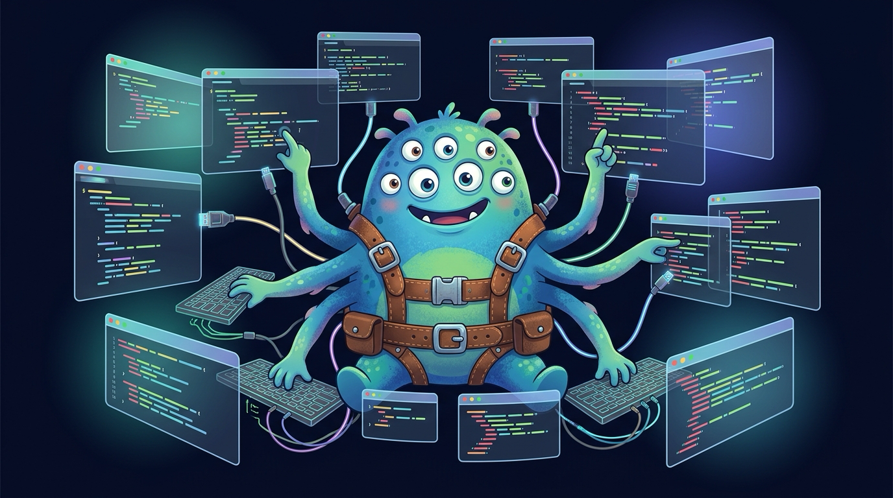

# Why MonsterFlow Exists

*The long version. The short version lives in the [aside on the landing page](https://jstottlemyer.github.io/MonsterFlow/#why).*

---

I've always been a builder, so building this as a personal tooling layer felt needed because none of the harnesses I could find had all the self-learning loops I wanted to be there for a fully self-improving / self-optimizing harness, based on how the user leverages the tool. Over time, it'll adapt for your best practices or lack thereof and build compensating controls.

It's all built from Claude CLI which is my happy place (a terminal window). I found while working on iOS games, MCP's, a Script Continuity Engine, and as a Fractional CTO business in San Jose and a day job at Intuit that the bleeding edge of harnesses is changing daily as power users architect different solutions built on the shoulders of those they saw before them.

The pipeline has been useful on real projects and this very repo's overnight builds.

My years of coding, architecting, leading, grew and changed my skills over the years, my time became more valuable to guide others. My fingers crept further from the keyboard over the years in a Faustian deal to provide more value. As I sit looking at my 7 CMUX tabs, and my MonsterFlow harness, I feel I can build anything, just not everything because even I have limits and can only get my ideas out so quickly to build.

MonsterFlow is partly my answer to that distance — when I can't be on every keystroke, I want to at least know which of the reviewers are catching what matters and which are noise dressed up as rigor. The 5 multi-agent gates give the leverage. The judging is what gives me the trust.

The measurement layer is newer and I'm still watching whether the signals are meaningful. An early evaluation allowed me to consolidate 6 agents into the rest of the pack due to overlapping functionality. Which gave the idea to both raise the quality of my agents to a higher standard but to also judge and score them over time.

Early signals are encouraging — drift on a few personas I'd otherwise have kept around, a new wave-sequencer persona suggested by an adversarial Codex review and now earning its slot, graph-driven queries hitting 10–20× fewer tokens than full-corpus reads on the codebases I've benchmarked. Whether any of that holds across more features and more contributors is the next 50 wraps' worth of homework.

What I do know: 40 reviewers who never get tired, never skip the security section because they're running late, and whose participation is logged and measured — has changed how I think about what review is for. As one of my friends recently confessed, I don't ship code anymore, I ship outcomes.

— Justin · MIT-licensed, genuinely experimental
